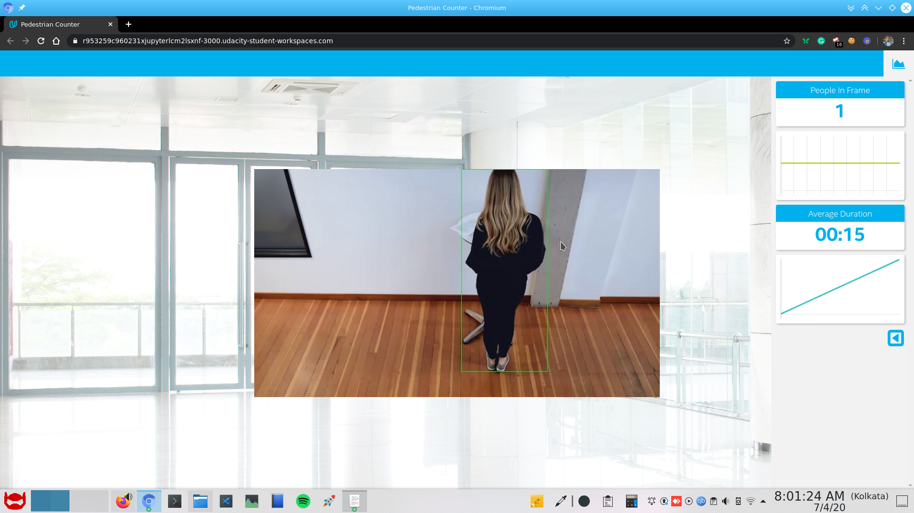

# People Counter App

This application can track multiple people in real time and display there average durantion in the frame. This can be used for various potentially usefull senarios like a social distancing checker application that notify the people if they are close. This application uses [ssd_mobilenet_v2_coco](http://download.tensorflow.org/models/object_detection/ssd_mobilenet_v2_coco_2018_03_29.tar.gz) model from tensorflow [model zoo](https://github.com/tensorflow/models/blob/master/research/object_detection/g3doc/detection_model_zoo.md).

## Explaining Custom Layers

There is a [list of layers](https://docs.openvinotoolkit.org/2019_R3/_docs_MO_DG_prepare_model_Supported_Frameworks_Layers.html) that model optimizer supports all the other layers are classified as custom layer by the model optimizer. This list is different for each supported framework. When initialized, the [model optimizer](https://docs.openvinotoolkit.org/2019_R1.1/_docs_MO_DG_Deep_Learning_Model_Optimizer_DevGuide.html) matches the layers that are detected in the model to the supported layers list before creating the IR file. Custom layers allow the conversion of a model into Intermediate Representation, without them the model optimizer can not progress because model optimizer does not know about the custom layer and how to represent then in the IR file.

## Comparing Model Performance
There is a huge improvement in the model performance after using OpenVINO model optimizer. CPU overhead also decreased after conversion.

### Model size

- frozen_inference_graph.pb (67M)
- frozen_inference_graph.xml (109K) &  frozen_inference_graph.bin (65M)

### Performance
- Inference time before conversion
	- Average ~140ms
	- Minimum ~90ms
	- Maximum ~500ms
- Inference time after conversion
	- Average ~5ms
	- Minimum ~1ms
	- Maximum ~70ms
	
This is huge performance boost allows the model to be edge deployable because for edge devices we have limitations with speed and bandwidth.

## Assess Model Use Cases

As previously discussed one of the use case of this model can be to alert people when social distancing is not followed. Some other use cases might include.

- Number of people in the room at a specific time of the day. This can be used as marker for the webcam footage, it will allow to perform smart skipping of the footage.
- Smart monitoring for shops to detect how many people came each day and which period of the day is rushy, which will allow them to optimize for more sales.

## Assess Effects on End User Needs

Lighting, model accuracy, and camera focal length/image size have different effects on a
deployed edge model. The potential effects of each of these are as follows...

- Lighting, It has been noticed that a well lit room provides a good quality image for the webcam and thus increases the chance of detecting the person successfully.
- Model Accuracy, The deployed edge model must have good enough accuracy and provide good inference time. The balance between two is very important. There will be some trade off between the two. The motive is to get real-time inference and responsive application.
- Camera focal length, A CNN model trained with images taken from different focal length cameras will allow us to create a better edge deployment. Cameras with higher focal length will only allow us to see a specific object more clearly which is far away but a camera with lower focal length will give a wider image for the model.
- Image Size, If the image we feed to the model is large it will be hard for the edge device to make an inference. If the image is small we will not be able to see the details correctly. A sweet spot must be chosen that gives good response time and clear view of the images.

# Model Downloading & conversion
## 1. Download

The model is taken from tensorflow [model zoo](https://github.com/tensorflow/models/blob/master/research/object_detection/g3doc/detection_model_zoo.md). 

- `$ wget http://download.tensorflow.org/models/object_detection/ssd_mobilenet_v2_coco_2018_03_29.tar.gz`
- `$ tar -xvf ssd_mobilenet_v2_coco_2018_03_29.tar.gz`.

## 2. Convert

- `cd ssd_mobilenet_v2_coco_2018_03_29`
- `python /opt/intel/openvino/deployment_tools/model_optimizer/mo_tf.py --input_model frozen_inference_graph.pb --tensorflow_object_detection_api_pipeline_config pipeline.config --tensorflow_use_custom_operations_config /opt/intel/openvino/deployment_tools/model_optimizer/extensions/front/tf/ssd_v2_support.json --reverse_input_channel`

# Running the app
After starting the servers, you can run the app using this command.

- `python main.py -i resources/Pedestrian_Detect_2_1_1.mp4 -m /home/workspace/ssd_mobilenet_v2_coco_2018_03_29/frozen_inference_graph.xml -l /opt/intel/openvino/deployment_tools/inference_engine/lib/intel64/libcpu_extension_sse4.so -d CPU -pt 0.6 | ffmpeg -v warning -f rawvideo -pixel_format bgr24 -video_size 768x432 -framerate 24 -i - http://0.0.0.0:3004/fac.ffm`